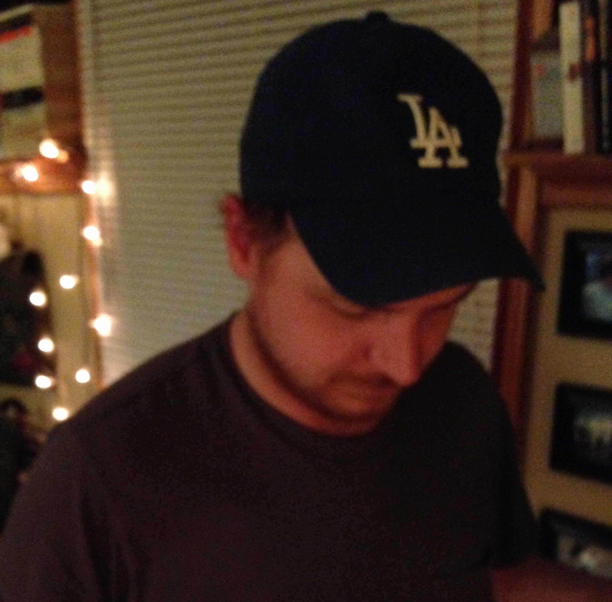

Meet The ISU 2015 Data Mining Cup Team
======================================
<!--
This is the team picture page. 
I know that I am bad with names and faces, and I imagine some of you are too. 
The idea here is that making this page will be a fun exercise to get used to editing documents on github
and to help us get to know each other.

So - the idea is this:

Add a picture to the team_pics folder, and edit the following template:

<a href="./team_pics/YOUR_PICTURE_FILE" style="clear: left; float: left; margin-bottom: 1em; margin-right: 1em;">" width="100"/></a>  

<b>YOUR_NAME (YOUR_DEPT)</b> 
Two Facts and a Falsehood
<ul>
   <li>FACT_1</li>
   <li>FACT_2</li>
   <li>FACT_3</li>
</ul>

The parts you need to edit are LIKE_THIS
-->

  
<b>Ian Mouzon (STAT)</b> 
Two Facts and a Falsehood
<ul>
   <li>I have been shot in the face</li>
   <li>I have been stabbed in the knee</li>
   <li>I have been beaten unconscious</li>
</ul>

  
<b>Alex Shum (STAT)</b> 
Two Facts and a Falsehood
<ul>
   <li>This fact is true.</li>
   <li>This fact is false.</li>
   <li>This is a fact</li>
</ul>

