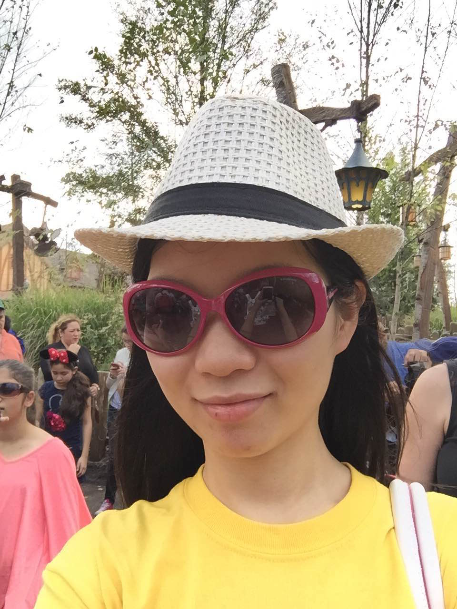
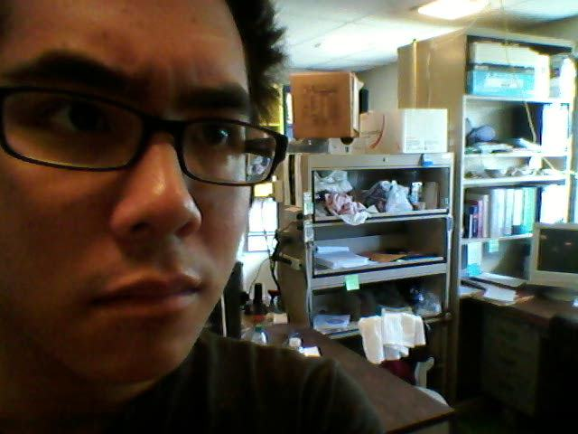
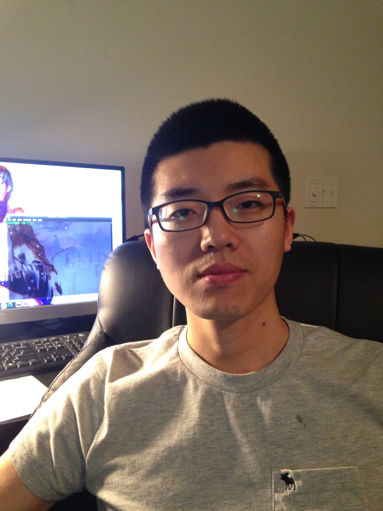

Meet The ISU 2015 Data Mining Cup Team
======================================
<!--
This is the team picture page. 
I know that I am bad with names and faces, and I imagine some of you are too. 
The idea here is that making this page will be a fun exercise to get used to editing documents on github
and to help us get to know each other.

So - the idea is this:

Add a picture to the team_pics folder, and edit the following template:

<table>
   <tbody>
      <tr>
         <th>YOUR_NAME (YOUR_DEPT)</th>
         <th align="center">Two Facts and a Falsehood</th>
      </tr>
      <tr>
         <td>
            
         </td>
         <td>
            <ol>
               <li>FACT_1</li>
               <li>FACT_2</li>
               <li>FACT_3</li>
            </ol>
         </td>
      </tr>
   </tbody>
</table>

The parts you need to edit are LIKE_THIS
-->

<table>
   <tbody>
      <tr>
         <th>Ran Bi (STAT)</th>
         <th align="center">Two Facts and a Falsehood</th>
      </tr>
      <tr>
         <td>
            
         </td>
         <td>
            <ol>
               <li>I did not have my lunch today</li>
               <li>I play piano every month</li>
               <li>I love ice cream</li>
            </ol>
         </td>
      </tr>
   </tbody>
</table>

<table>
   <tbody>
      <tr>
         <th>Yihua Li (IMSE/STAT)</th>
         <th align="center">Two Facts and a Falsehood</th>
      </tr>
      <tr>
         <td>
            
         </td>
         <td>
            <ol>
               <li>I love ice cream.</li>
               <li>I love cilantro.</li>
               <li>I love sleeping.</li>
            </ol>
         </td>
      </tr>
   </tbody>
</table>

<table>
   <tbody>
      <tr>
         <th>Ian Mouzon (STAT)</th>
         <th align="center">Two Facts and a Falsehood</th>
      </tr>
      <tr>
         <td>
            
         </td>
         <td>
            <ol>
               <li>I have been beaten unconscious</li>
               <li>I have been shot in the face</li>
               <li>I have been stabbed in the knee</li>
            </ol>
         </td>
      </tr>
   </tbody>
</table>

<table>
   <tbody>
      <tr>
         <th>Liuhua Peng (STAT)</th>
         <th align="center">Two Facts and a Falsehood</th>
      </tr>
      <tr>
         <td>
            
         </td>
         <td>
            <ol>
               <li>I am Liuhua Peng.</li>
               <li>Liuhua Peng is my name.</li>
               <li>I like eating.</li>
            </ol>
         </td>
      </tr>
   </tbody>
</table>

<table>
   <tbody>
      <tr>
         <th>Alex Shum (STAT/CS)</th>
         <th align="center">Two Facts and a Falsehood</th>
      </tr>
      <tr>
         <td>
            
         </td>
         <td>
            <ol>
               <li>This fact is true.</li>
               <li>This fact is false.</li>
               <li>Squirtle is the best starter pokemon.</li>
            </ol>
         </td>
      </tr>
   </tbody>
</table>

<table>
   <tbody>
      <tr>
        <th>Weicheng Zhu (STAT)</th>
        <th align="center">Two Facts and a Falsehood</th>
      </tr>
      <tr>
         <td>
            
         </td>
         <td>
            <ol>
               <li>Xfce is my favorite desktop environment.</li>
               <li>I'm learning openGL.</li>
               <li>Vim is my basic editor.</li>
            </ol>
         </td>
      </tr>
   </tbody>
</table>
