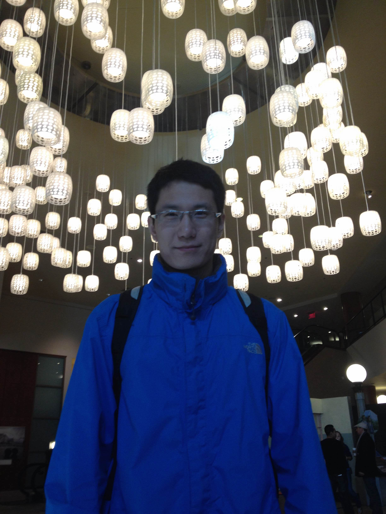
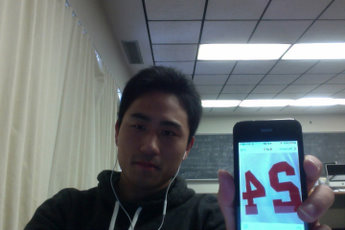

Meet The ISU 2015 Data Mining Cup Team
======================================
<!--
This is the team picture page. 
I know that I am bad with names and faces, and I imagine some of you are too. 
The idea here is that making this page will be a fun exercise to get used to editing documents on github
and to help us get to know each other.

So - the idea is this:

Add a picture to the team_pics folder, and edit the following template:

<table>
   <tbody>
      <tr>
         <th>YOUR_NAME (YOUR_DEPT)</th>
         <th align="center">Two Facts and a Falsehood</th>
      </tr>
      <tr>
         <td>
            
         </td>
         <td>
            <ol>
               <li>FACT_1</li>
               <li>FACT_2</li>
               <li>FACT_3</li>
            </ol>
         </td>
      </tr>
   </tbody>
</table>

The parts you need to edit are LIKE_THIS
-->

<table>
   <tbody>
      <tr>
         <th>Chen Hua (STAT)</th>
         <th align="center">Two Facts and a Falsehood</th>
      </tr>
      <tr>
         <td>
            
         </td>
         <td>
            <ol>
               <li>I like biking.</li>
               <li>I went to Italy last summer.</li>
               <li>I learning python.</li>
            </ol>
         </td>
      </tr>
   </tbody>
</table>

<table>
   <tbody>
      <tr>
         <th>Yaxuan Sun (STAT)</th>
         <th align="center">Two Facts and a Falsehood</th>
      </tr>
      <tr>
         <td>
            
         </td>
         <td>
            <ol>
               <li>I play Guitar</li>
               <li>I play soccer</li>
               <li>My favourite soccer team is Bayern Munich</li>
            </ol>
         </td>
      </tr>
   </tbody>
</table>

<table>
   <tbody>
      <tr>
         <th>Evan "Pete" Walsh (STAT)</th>
         <th align="center">Two Facts and a Falsehood</th>
      </tr>
      <tr>
         <td>
            
         </td>
         <td>
            <ol>
               <li>I hate doing dishes.</li>
               <li>Intro to Statistics was my lowest math/stat grade.</li>
               <li>I love eating brown rice.</li>
            </ol>
         </td>
      </tr>
   </tbody>
</table>

<table>
   <tbody>
      <tr>
         <th>Neo_Zhou (Math)</th>
         <th align="center">Two Facts and a Falsehood</th>
      </tr>
      <tr>
         <td>
            
         </td>
         <td>
            <ol>
               <li>I like NBA</li>
               <li>I like Kobe</li>
               <li>I like Math</li>
            </ol>
         </td>
      </tr>
   </tbody>
</table>
