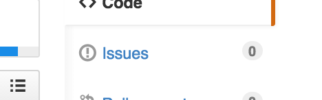
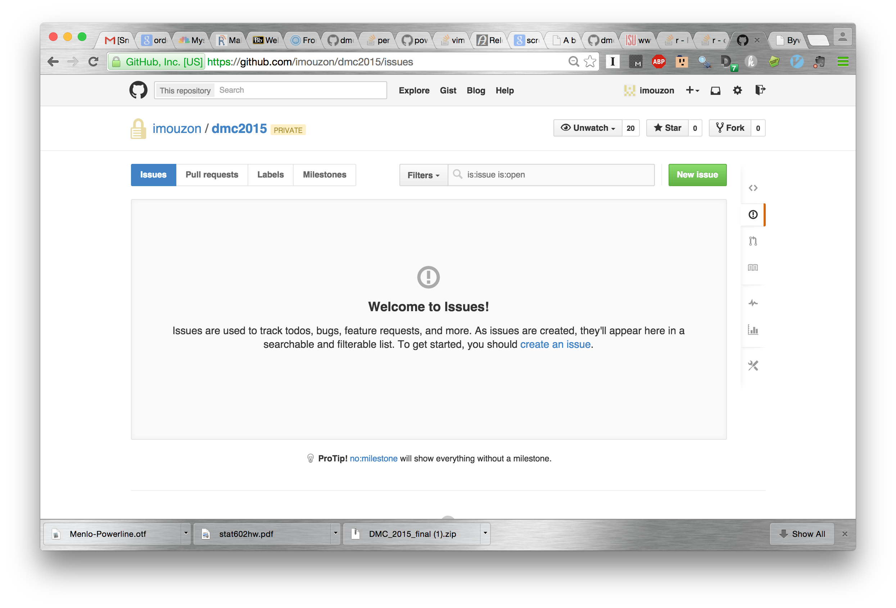
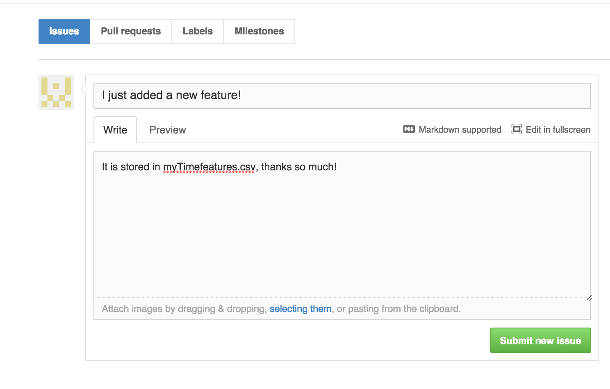

#Adding Features
The process for adding features is simple:

1. Create a new features 
2. Export that feature to a CSV file
3. Put that CSV file in the `dmc2015/features/feature_files/` folder
4. Add a new row to the file [feature_description](./feature_description.md)
5. Create an issue by clicking on the `!` mark symbol on the github page. This notifies the feature team that a new feature is ready.
6. Wait. The feature team will work on incorporating your feature into the next version of the feature matrix.

A more detailed description follows.

##1. Create a new features 
This is the hardest part. Using the raw data, exisiting features, and your personal know-how, 
create a column of set of columns that have some relationship to 
- the data structure
- coupon use
- basket value
Ideally these columns should have entries for every order in our dataset, 
but it is possible that there may be orders for which your features does not apply
(for instance, a feature for time since the customer's last visit would be blank during their first visit). 

**It is CRUCIAL that features are generated on both the training set and the test set in a consistent way**

##2. Export that feature to a CSV file
##3. Put that CSV file in the `dmc2015/features/feature_files/` folder
These two steps can be performed together
Features must be written to a file with `orderID` as a column. For a feature formatted as:
```
orderID  f1   f2   f3
1       2.3    1   -5
2       1.0    2   -1
3      55.2    1   -1
     .  .  .
6053   22.1    2    0
```
use the following code:
```R
write.csv(feature.d,file="~/dmc2015/features/feature_files/myTimefeatures.csv",quote=FALSE,na="",row.names=FALSE)
```
##4. Add a new row to the file feature_description.md
Navigate over to the file [feature_description.md](./feature_description.md) and create a new row in the feature description table describing your feature.

##5. Create an issue by clicking on the `!` mark symbol on the github page. 
Look for this button:

Clicking it takes you here:

And you can add a descriptive message here:


##6. Wait. The feature team will work on incorporating your feature into the next version of the feature matrix.
Creating an issue notifies the feature matrix team and they will be able to incorporate your results into the next feature matrix.
