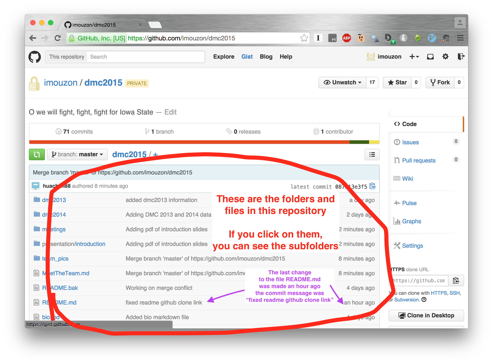

April 1st 2015
==============

Our first meeting went really well, but also really quickly.
The slides I presented are in the folder [presentation/introduction](https://github.com/imouzon/dmc2015/blob/master/presentation/introduction/DMC2015_intro.pdf)

##I Forgot SO Many Things
Our DMC meetings are usually "working meetings," 
by which I mean everyone works on things and we talk about 
plans/issues regarding the data and our approach to it.
There will never be that much talking by me again.
These are the things I forgot to do:

- Introduce myself in a proper way
- Have everyone else introduce themselves
- Pass around the "how comfortable are you with R/python/matlab/etc" sheet
- Give everyone time to edit MeetTheTeam.md
- Schedule future meetings
- Take everyone on a tour of the github page
- Talk up the `rDMC2015` R package we will make

Yikes! 
That's a lot of stuff to forget. 
We'll fix the first 3 next meeting, and I will fix the last 2 now. 
I can see that people are adding things to MeetTheTeam.md as I write this, 
so I suppose that is fixing itself.

##A tour around our github page
###The landing page
This is page you see on [https://github.com/imouzon/dmc2015/](https://github.com/imouzon/dmc2015/).
If you are just starting to use git, then these are the things you want to know:

You can see the repository file structure and view files just by visiting the github page:

If you click on a file, the window underneath the folder structure will attempt to show 
the contents of the file. By default, the folder will show README.md

###The folder structure

- `dmc2013` has the data and description of the 2013 DMC.
- `dmc2014` has the data and description of the 2014 DMC.
- `meetings` will contain meeting notes and post-notes
- `presentation` is a place where we can put results that we would like to present at meetings
- `how_to` contains guides on how to do things
- `data` will be where we put the data files
- `ian` is Ian's folder in the respository. He will keep code and some results here.
- `alex` is Alex's folder in the repository. He will keep code and some results here.
- ...

and so on.

##Schedule future meetings
Please respond to the poll at: 

[http://whenisgood.net/bz2rdwg/](http://whenisgood.net/bz2rdwg/).

This is to schedule a **permanent meeting time** - I am going to try to schedule twice a week, 
preferably late afternoon Tuesday and Friday.

##Sharing code is hard
With this many people working on the same problem, 
it is entirely possible that we will come up with some useful chunks of R code.
So I think it is a good idea to get a common R package going.
I have a private repository that I will finish setting up soon and we can all start adding to it.
