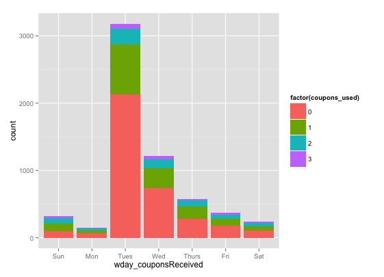

## Pete's folder

### Findings
----

#### All coupons expire before Tuesday

```r
train$orderTime <- ymd_hms(train$orderTime)
train$couponsReceived <- ymd_hms(train$couponsReceived)
train$time_diff = train$orderTime - train$couponsReceived

# create variable for difference in times (minutes)
train$minute_diff = as.numeric(train$time_diff) / 60
train$day_diff = (ceiling_date(train$orderTime, "day") - 
		  ceiling_date(train$couponsReceived, "day")) / (3600*24)

# create variable for day of the week, for both recieved and order time
train$wday_orderTime <- wday(train$orderTime, label=T)
train$wday_couponsReceived <- wday(train$couponsReceived, label=T)
```

```r
train %>% ggplot(aes(x = wday_couponsReceived, fill = wday_orderTime)) + 
	geom_bar()
```

