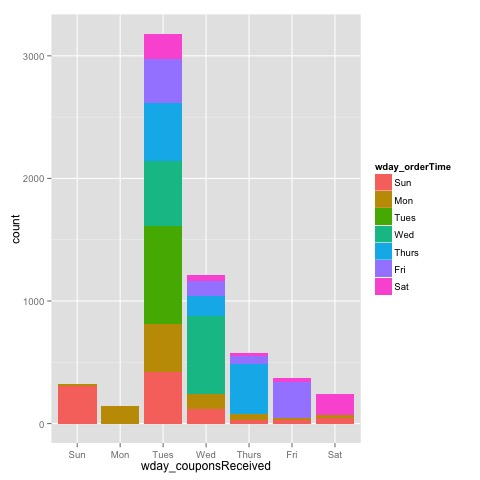
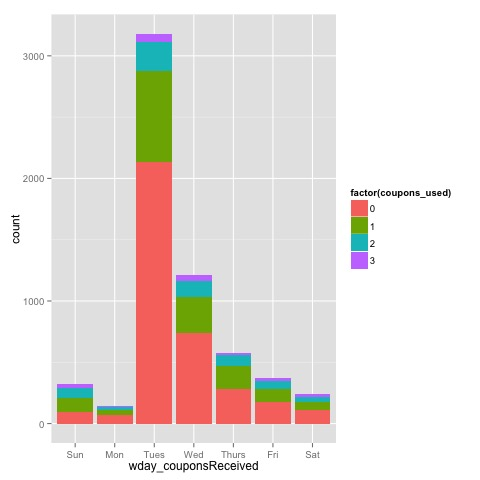
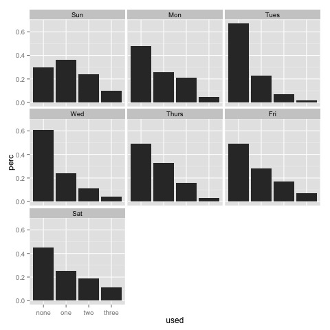

## Pete's folder

### Findings
----

#### All coupons expire before Tuesday

```r
train$orderTime <- ymd_hms(train$orderTime)
train$couponsReceived <- ymd_hms(train$couponsReceived)
train$time_diff = train$orderTime - train$couponsReceived

# create variable for difference in times (minutes)
train$minute_diff = as.numeric(train$time_diff) / 60
train$day_diff = (ceiling_date(train$orderTime, "day") - 
		  ceiling_date(train$couponsReceived, "day")) / (3600*24)

# create variable for day of the week, for both recieved and order time
train$wday_orderTime <- wday(train$orderTime, label=T)
train$wday_couponsReceived <- wday(train$couponsReceived, label=T)
```

```r
train %>% ggplot(aes(x = wday_couponsReceived, fill = wday_orderTime)) + 
	geom_bar()
```


#### Coupon 1 is used the most, followed by coupon 2, and then coupon 3

```r
sum(train$coupon1Used)
# [1] 1438
sum(train$coupon2Used)
# [1] 1129
sum(train$coupon3Used)
# [1] 1008
```

#### Coupon usage rate is greater for people receiving coupons later in the week

```r
train$coupons_used = train$coupon1Used + train$coupon2Used + train$coupon3Used
train %>% ggplot(aes(x = wday_couponsReceived, fill = factor(coupons_used))) + 
	geom_bar()
```


```r
usage = train %>% group_by(wday_couponsReceived) %>%
  summarize(none = round(sum(coupons_used == 0) / length(coupons_used), 2),
            one = round(sum(coupons_used == 1) / length(coupons_used), 2),
            two = round(sum(coupons_used == 2) / length(coupons_used), 2),
            three = round(sum(coupons_used == 3) / length(coupons_used), 2)) %>%
  melt(id = "wday_couponsReceived", 
       variable.name = "used",
       value.name = "perc")
usage <- usage[order(usage$wday_couponsReceived),]
qplot(used, perc, data = usage, facets = ~wday_couponsReceived, 
      geom="bar", stat = "identity")
```

