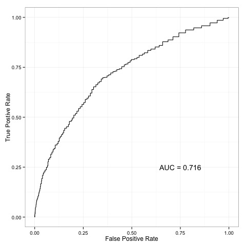

## Pete's folder

### Conditional Random Forest Performance so far
>Historical set 1

>

### What needs to be done

- Split training data into three different sets: ```historical```, ```train```, and ```validation```.
	- Split using several different methods such as chronological, stratified sampling, sample among users, etc.
- Create log likelihood features out of the ```historical``` data sets to use in each training and validation set.
- Run models to predict coupon usage and basket value
	- We can also use coupon usage predictions to predict basket value, or visa versa
- Models to run:
	- Random forests
	- Conditional RF's
	- Boosting
	- SVM's
	- C5.0
	- Ridge regression
	- LASS0
	- .....
- Evaluate models based on prediction accuracy
- Train all models again this time on ```training + validation``` set.
- Take weighted average of predictions from all models based on validation performance. These are the final predictions.
