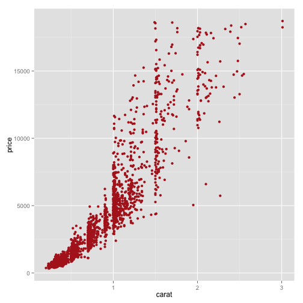

## Quick example with ggplot2
 

---

## Slide 2

---

## slide 3

---

## Two Column Layout   
This slide has two columns

*** {name: left}

- point 1
- point 2
- point 3

*** {name: right}

- point 1
- point 2
- point 3
