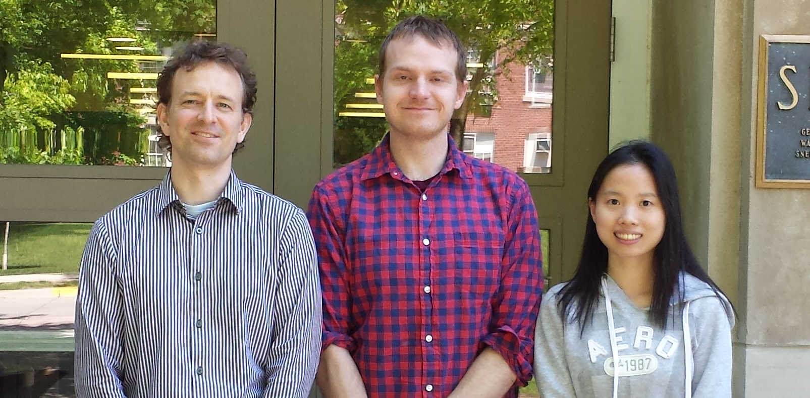
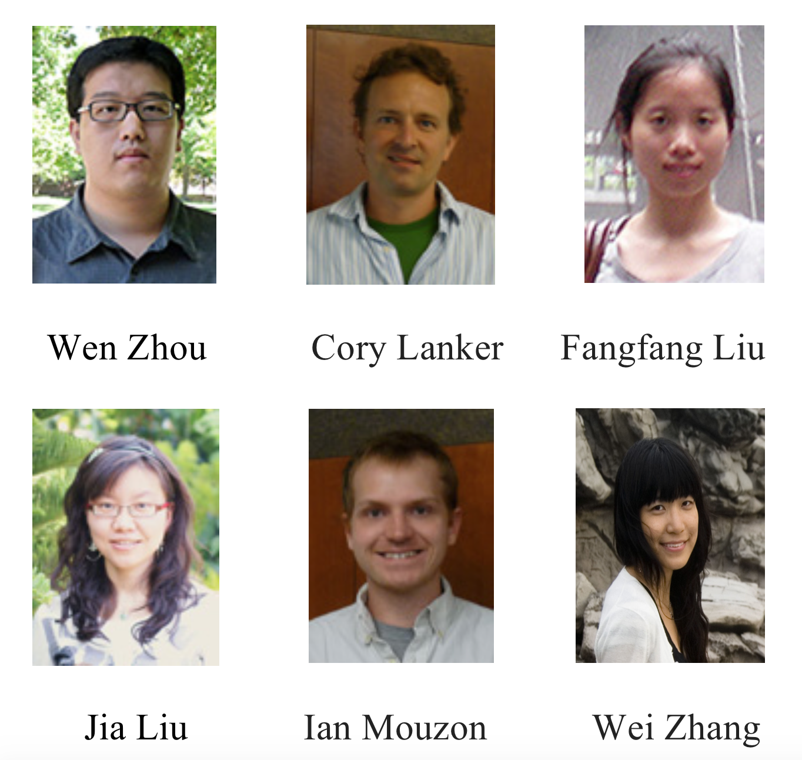
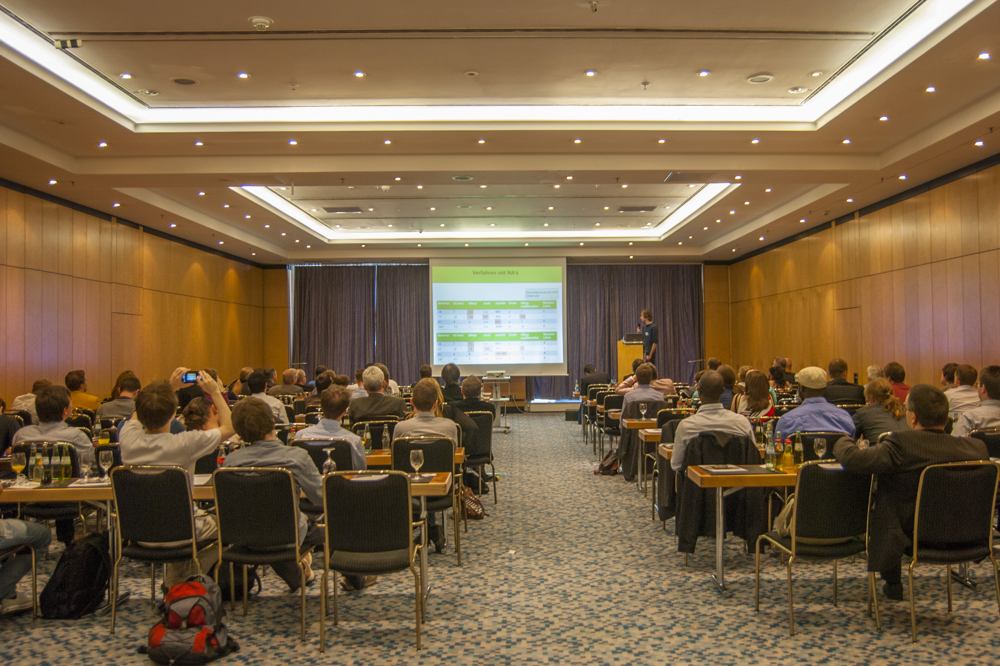

<!DOCTYPE html>
<html>
   <head>
      <title>Title</title>
      <meta http-equiv="Content-Type" content="text/html; charset=UTF-8"/>
      <meta name="keywords" content="dmc,data mining,dmc2015,intro"/>
      <meta name="description" content="Introduction to the 2015 Data Mining Cup"/>
      
   </head>
   <body>
   <textarea id="source">

name: inverse
layout: true
class: center, middle, inverse
---
# So You Want To Be a Data Miner?
## The 2015 Data Mining Cup
### What to Expect When You're Predicting
.footnote[A link to our [github page](https://github.com/imouzon/dmc2015)]
---
#What Is The Data Mining Cup
#and 
#Why Are We Here?
---
layout: false
.left-column[
  ## What is it?
]
.right-column[

 

The Data Mining Cup is a yearly competition hosted by prudsys (all lower case) a German analytics company
focused on marketplace behavior. prudsys describes it this way:
> The DATA MINING CUP (DMC for short) has been inspiring students around the world to pursue intelligent data analysis since the year 2000.
> In 2014 over one thousand students from about 100 universities in 28 countries took part in the competition.
> The best teams will be invited to Berlin for the awards ceremony at the prudsys personalization summit.
]
---
.left-column[
  ## What is it?
  ## Why am I here?
]
.right-column[

 

]
---
name: inverse
layout: true
class: center, middle, inverse
---
#Only you can answer that
# Money? 
# Power?
# Glory?
---
#I can tell you why I'm here
---
layout: false
.left-column[
  ## What is it?
  ## Why am I here?
]
.right-column[

 

##In Spring 2013 I was taking STAT 602
- And 602 was really, really hard.
- So hard that I didn't even **look** at the midterm when I got it back
- But I knew that "data mining" was important and I liked it
- I just needed a chance to prove to myself that I could do it
]
---
.left-column[
  ## What is it?
  ## Why am I here?
]
.right-column[
##That's when I joined the Data Mining Cup Team
And as if by magic STAT 602 started making much more sense.
Without the big complicated data sets, 
it's hard to see where these theories and techniques matter. 
But working with these datasets takes up so much time, 
the methods become bizarre black boxes.
Working at the DMC gave me:
###Data Mining Experience
- A better understanding of why we need Machine Learning techniques
- A chance to apply what I was learning without any guardrails
- A chance to learn from others who had been through this before
]
---
.left-column[
  ## What is it?
  ## Why am I here?
]
.right-column[
###Better Computing Skills
- The problems you have to deal with are often computational, and you get better at working through them
- I got much better at R during this competition (I learned how to use `knitr` for instance)

###Collaborative Skills
- I got the chance to work hard at something because people were depending on me
- People working together on the same problem disagree - we had to resolve conflicts and move on
- Our solution is the hard work of several people, all woven together
- As the days went past, we got really close (friends for life kinda stuff)
]
---

<h1>I may not be much better at this stuff</h1>
 

---
.left-column[
  ## What is it?
  ## Why am I here?
  ## We almost won
]
.right-column[
###We came in fifth 
####People went to Germany

   

    
    
    

]
---
.left-column[
  ## What is it?
  ## Why am I here?
  ## We almost won
  ## In 2014 we did win
]
.right-column[

    

]
---
name: inverse
layout: true
class: center, middle, inverse
---
   #I may not be much better at this stuff
---

 

      </textarea>
      
      
      
      
      
   </body>
</html>
