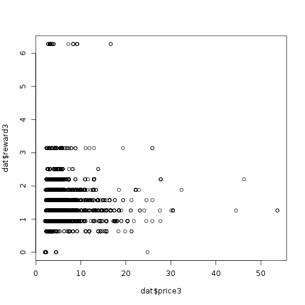

# My Findings


## Data understanding

## Q1: Does one particular coupon belong to only one couponID?


```r
## Q: Does one particular coupon belong to only one couponID?
## A: No
nlevels(dat$couponID1) + nlevels(dat$couponID2) + nlevels(dat$couponID3)
```

```
## [1] 4846
```

```r
coupon = c(as.character(dat$couponID1), as.character(dat$couponID2),
    as.character(dat$couponID3))

length(unique(coupon))
```

```
## [1] 3345
```

## Q2: Reward distributions?


```r
## Q: Reward distributions?
## reward1, 2, 3 have the same reward 'standard'
sort(unique(dat$reward1))
```

```
##  [1] 0.00 0.63 0.94 1.26 1.57 1.88 2.20 2.51 3.14 6.28
```

```r
sort(unique(dat$reward2))
```

```
##  [1] 0.00 0.63 0.94 1.26 1.57 1.88 2.20 2.51 3.14 6.28
```

```r
sort(unique(dat$reward3))
```

```
##  [1] 0.00 0.63 0.94 1.26 1.57 1.88 2.20 2.51 3.14 6.28
```

```r
## barplot
reward = with(dat,
     {
         rbind(table(reward1), table(reward2), table(reward3))
     })
barplot(reward, beside=TRUE, legend.text = c("reward1", "reward2", "reward3"))
```

 

## Q3: Price distributions?


```r
## Q: Price distributions?
summary(dat$price1)
```

```
##    Min. 1st Qu.  Median    Mean 3rd Qu.    Max. 
##   1.810   3.980   5.840   7.059   9.080  87.990
```

```r
summary(dat$price2)
```

```
##    Min. 1st Qu.  Median    Mean 3rd Qu.    Max. 
##   1.200   3.890   5.460   6.229   7.970  74.050
```

```r
summary(dat$price3)
```

```
##    Min. 1st Qu.  Median    Mean 3rd Qu.    Max. 
##   2.040   3.520   4.580   5.813   6.760  53.670
```

```r
price = melt(dat[c("price1", "price2", "price3")])
```

```
## No id variables; using all as measure variables
```

```r
ggplot(price, aes(value, fill = variable)) + geom_histogram(position = "dodge")
```

 

```r
ggplot(price, aes(value, fill = variable)) + geom_histogram(binwidth = 1, position = "dodge") + xlim(0, 20)
```

 

## Q4: Price distributions?


```r
## Q: Price distributions?
basePrice = melt(dat[c("basePrice1", "basePrice2", "basePrice3")])
```

```
## No id variables; using all as measure variables
```

```r
ggplot(basePrice, aes(value, fill = variable)) + geom_histogram(position = "dodge")
```

 

```r
ggplot(basePrice, aes(value, fill = variable)) + geom_histogram(binwidth = 1, position = "dodge") + xlim(0, 25)
```

 

## Q5: BasketValue distribution?


```r
## Q: basketValue distribution?
summary(dat$basketValue)
```

```
##      Min.   1st Qu.    Median      Mean   3rd Qu.      Max. 
##     46.36    186.30    212.60    315.50    294.10 135800.00
```

```r
hist(dat$basketValue[dat$basketValue<1000])
```

 
## Q6: coupon usage: 1 > 2 > 3


```r
## Q: coupon usage: 1 > 2 > 3
sum(dat$coupon1Used)
```

```
## [1] 1438
```

```r
sum(dat$coupon2Used)
```

```
## [1] 1129
```

```r
sum(dat$coupon3Used)
```

```
## [1] 1008
```

```r
## total coupon usage rate
sum(dat$coupon1Used + dat$coupon2Used + dat$coupon3Used > 0)/nrow(dat)
```

```
## [1] 0.4040971
```

```r
## The distributions of basketValue for customers who used coupon and
## who didn't use coupon are similar
coupon_yes= dat[dat$coupon1Used + dat$coupon2Used + dat$coupon3Used > 0,]
coupon_no= dat[dat$coupon1Used + dat$coupon2Used + dat$coupon3Used ==  0,]

summary(coupon_yes$basketValue)
```

```
##    Min. 1st Qu.  Median    Mean 3rd Qu.    Max. 
##   46.36  186.80  211.70  271.30  290.30 7799.00
```

```r
summary(coupon_no$basketValue)
```

```
##      Min.   1st Qu.    Median      Mean   3rd Qu.      Max. 
##     47.28    186.00    213.00    345.40    298.10 135800.00
```

```r
coupon = data.frame(basketValue = c(coupon_yes$basketValue, coupon_no$basketValue),
    couponUsed = c(rep("yes", nrow(coupon_yes)), rep("no", nrow(coupon_no))))

ggplot(coupon, aes(basketValue, fill = couponUsed)) +
    geom_histogram(position = "dodge") + xlim(0, 500)
```

 

## Q7:  BasketValue vs coupon usage rate


```r
## Q:
## basketValue vs coupon usage rate
dat1 = dat[,29:32]

bv = seq(45, 1000, by = 5)
w = 30
couponRate = numeric(length(bv))
for(i in 2:length(bv)){
    tmp = dat1[(dat1$basketValue > bv[i-1]-w) & (dat1$basketValue < bv[i]+w),]
    couponRate[i-1] = sum(tmp$coupon1Used + tmp$coupon2Used + tmp$coupon3Used > 0)/nrow(tmp)
}
plot(bv, couponRate, type="l", xlab="basketValue")
```

 

```r
## basketValue > 1000
highBV = dat[dat$basketValue > 1000,]
sum(highBV$coupon1Used + highBV$coupon2Used + highBV$coupon3Used > 0)/nrow(highBV)
```

```
## [1] 0.2621359
```

```r
range(dat$price1)
```

```
## [1]  1.81 87.99
```

```r
range(dat$basePrice1)
```

```
## [1]    0.00 3519.56
```

```r
plot(dat$price1, dat$basePrice1, ylim = c(0, 100))
```

 

```r
plot(dat$price1, log(dat$basePrice1), ylim = c(0, 10))
```

 

```r
plot(dat$price1, dat$reward1)
```

 

```r
plot(dat$price2, dat$reward2)
```

 

```r
plot(dat$price3, dat$reward3)
```

 

